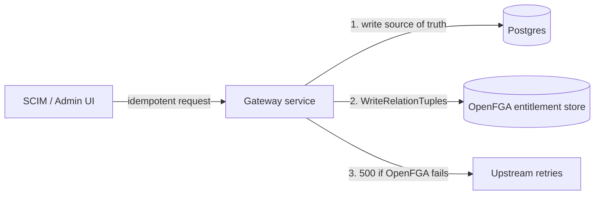
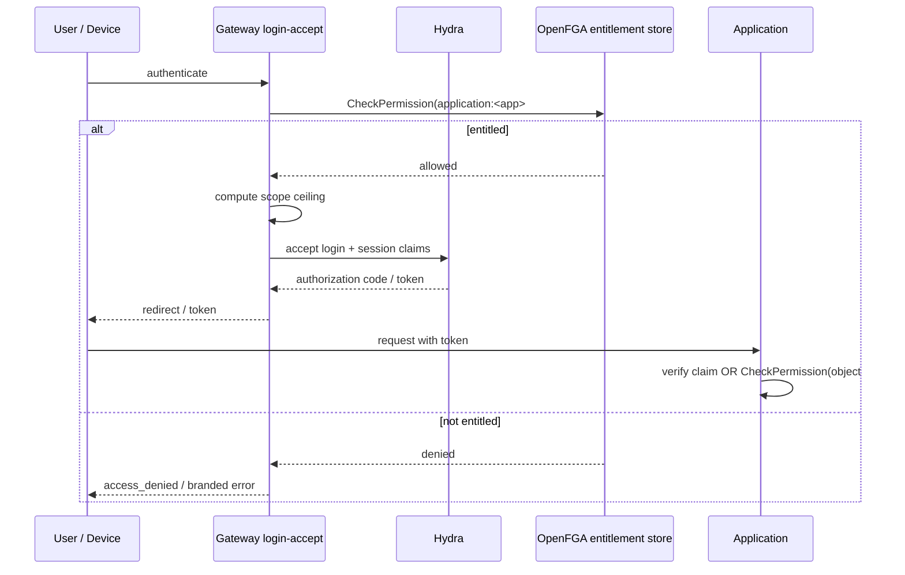

# Application Entitlements for the SSO Gateway

## Abstract

This document specifies the application entitlement model for the Sunbeam
SSO gateway: the mechanism that decides whether a user may use an
application at all, and at what level (member or administrator), as a layer
distinct from application-internal object permissions. The model places
entitlements in a gateway-owned OpenFGA namespace, instantiated once per
tenant using the existing per-(tenant, namespace) store mapping, and
enforces them at OAuth2 login acceptance — the single choke point through
which every interactive flow passes. Entitlements are surfaced to
applications as a per-client claim minted at token issuance, so application
count does not inflate the OAuth2 scope vocabulary, token size, or the
number of authorization stores. The document also specifies a per-user
scope ceiling derived from entitlements, which closes the present
client-level-only scope ceiling that allows any authenticated user to
self-mint administrative tokens through a public client. Application-admin
to in-application-admin bridging is defined as a disjunction at enforcement
time rather than as cross-store relation tuples.

## Document Status

This document is in **Accepted** status. Category: Standards Track. It has
been approved by the Principal Engineer and is ready for implementation.

Design inputs: agent-mail #57 (problem statement) and #69 (industry
survey), both reproduced in the Acknowledgements.

## Table of Contents

- [1. Introduction](#1-introduction)
  - [1.1. Requirements Language](#11-requirements-language)
  - [1.2. Terminology](#12-terminology)
- [2. Architecture Overview](#2-architecture-overview)
- [3. Component Specifications](#3-component-specifications)
- [4. Data Model](#4-data-model)
- [5. Interface Definitions](#5-interface-definitions)
- [6. Operational Behavior](#6-operational-behavior)
  - [6.1. Administrative Lifecycle](#61-administrative-lifecycle)
  - [6.2. Data Flow](#62-data-flow)
  - [6.3. Failure Modes](#63-failure-modes)
- [7. Compatibility and Migration](#7-compatibility-and-migration)
- [8. Open Questions](#8-open-questions)
- [9. Security Considerations](#9-security-considerations)
- [10. Deployment Considerations](#10-deployment-considerations)
- [11. References](#11-references)
  - [11.1. Normative References](#111-normative-references)
  - [11.2. Informative References](#112-informative-references)
- [Acknowledgements](#acknowledgements)
- [Author's Address](#authors-address)

---

## 1. Introduction

Two distinct authorization questions exist around every application
integrated with the SSO gateway:

1. **Application entitlement** — may this user use this application at all,
   and at what level? This question currently has no home. It is answered
   accidentally by OAuth2 client scope ceilings.
2. **Application-internal permissions** — may this user act on this object
   inside the application? This question has a home: per-application OpenFGA
   namespaces via the gateway's `PermissionService`, one OpenFGA store per
   (tenant, namespace).

Because entitlements have no home, scope ceilings live entirely on the
OAuth2 client (the Hydra `scope` field), not on the user. Any authenticated
user who can drive a flow with a client can request anything in that
client's ceiling. Concretely: the public Sunbeam CLI client currently
carries all six `*:admin` scopes in its ceiling, so any user can hand-roll
a device-authorization flow and self-mint an administrative token. This is
tolerable only while every account is an employee; it must not survive the
first `default`, `external`, or `community` account.

This document specifies the entitlement layer that fixes both gaps. It is
constrained by three facts of the existing system:

- The scope vocabulary is a flat, application-agnostic list
  (`crates/sso-gateway/src/auth.rs:16-48`). With 40 registered applications
  the vocabulary MUST still be ~14 scopes, not 120+. Per-application scope
  strings are rejected as a design direction; entitlement is data, not
  scope strings.
- OpenFGA stores are per (tenant, namespace), and OpenFGA cannot chain
  usersets across stores. Zanzibar-style single-graph inheritance is
  therefore architecturally closed.
- Tenancy is resolved from the token subject, and users hold per-tenant
  memberships (`tenant_memberships`). Entitlements MUST be per
  (tenant, user, application); the same identity may administer an
  application in one tenant and have no access in another.
- The identity **schema** (`tenant_memberships.schema_id`) defines the
  shape and validation of a user's traits; it MUST NOT be used as an
  authorization role. Role membership lives in the entitlement layer
  (SCIM groups, explicit grants, or tenant-wide default rules).

### 1.1. Requirements Language

The key words "MUST", "MUST NOT", "REQUIRED", "SHALL", "SHALL NOT",
"SHOULD", "SHOULD NOT", "RECOMMENDED", "NOT RECOMMENDED", "MAY", and
"OPTIONAL" in this document are to be interpreted as described in
BCP 14 [RFC2119] [RFC8174] when, and only when, they appear in all
capitals, as shown here.

### 1.2. Terminology

**Application (app)**: A software system registered with the gateway as a
row in the `applications` table, backed by one or more OAuth2 clients.

**Entitlement**: The per-(tenant, user, application) authorization to use
an application, at a level of `member` or `admin`. Derived from groups,
explicit grants, or tenant-wide default rules — not from the identity
schema.

**Entitlement namespace**: The reserved, gateway-owned OpenFGA namespace
that stores entitlements, one store per tenant (see [Section 3.1](#31-entitlement-namespace)).

**App-internal permissions**: Object-level authorization inside an
application (e.g. board ownership in kanban), held in the application's own
OpenFGA namespace. Out of scope for this document except at the admin
bridge ([Section 3.5](#35-application-admin-bridge)).

**Scope ceiling**: The maximum set of OAuth2 scopes a token may carry.
Today client-level only; this document adds a per-user inner ceiling
([Section 3.3](#33-per-user-scope-ceiling)).

**Entitlement claim**: The per-client token claim carrying the user's
entitlement for the requesting application ([Section 3.4](#34-entitlement-claim)).

**System tenant**: The bootstrap tenant configured via
`SYSTEM_TENANT_ULID`.

## 2. Architecture Overview

The entitlement model has five components, detailed in Section 3:

1. A gateway-owned `entitlements` namespace, one OpenFGA store per tenant,
   holding `application` and `group` object types.
2. A **login-time gate**: login acceptance checks
   `application:<app>#member @ user:<identity>` before any session or token
   exists.
3. A **per-user scope ceiling** derived from entitlements, applied wherever
   granted scopes are decided.
4. An **entitlement claim** minted at token issuance, containing only the
   requesting client's application entry.
5. An optional **application-admin bridge**: applications MAY treat
   "admin of the app" as a disjunction over the claim and their own OpenFGA
   checks.

The design follows the identity-provider-side pattern established by
Microsoft Entra (assignment-required sign-in gate plus per-app roles
claim), Zitadel (project user-grants asserted as per-audience role claims),
Keycloak (composite roles resolved before minting), and Okta (assignment as
entitlement, in-app permissions explicitly out of scope) [ENTRA][ZITADEL]
[KEYCLOAK][OKTA]. The single-relation-graph alternative (Zanzibar, the
OpenFGA entitlements pattern, GitLab group inheritance) requires
cross-object chaining in one store and is ruled out by the per-app store
topology [ZANZIBAR][OPENFGA-ENT].

### 2.1. Scale check

The model is required to hold at 40 applications per tenant without growth
in the token, the scope list, or the store count:

| Dimension | At 40 applications per tenant |
|---|---|
| OAuth2 scope vocabulary | Unchanged: ~14 flat gateway-API scopes |
| Entitlement objects | 40 `application` + a handful of `group` |
| Relation tuples | ~40 group tuples ("employees may use every app") + 1 per explicit grant |
| Claim size per token | 1 application entry, always |
| Checks per login | 2 (membership + ceiling), same store |
| OpenFGA stores | 1 entitlement store per tenant (existing machinery) |

## 3. Component Specifications

### 3.1. Entitlement Namespace

**Responsibility**: Stores all entitlements for one tenant.

**Interface**: The existing `PermissionService` RPC surface
(`WriteRelationTuples`, `CheckPermission`, `ListRelationTuples`,
`GetPermissionNamespace`). No new RPCs are required for management;
liminal and the CLI administer entitlements with `permission:admin`.

**State**: One OpenFGA store per tenant, named per the existing
`{tenant_id}-{namespace}` convention; registry row in
`permission_namespaces`, type index in `permission_namespace_types`.
Unlike application namespaces, which applications self-register via
`EnsurePermissionNamespace`, the entitlement namespace is owned and seeded
by the gateway itself.

**Rules**:

- The namespace name is reserved; applications MUST NOT register or mutate
  the entitlement model. `EnsurePermissionNamespace` MUST reject caller
  attempts to (re)define it.
- The gateway MUST seed the namespace (store + model) at tenant creation.
- `application` objects are keyed by the registered application's public
  ULID. The gateway's own API is represented as an application object
  (e.g. `application:<sso-gateway app ULID>`) so gateway-API scopes can be
  gated by entitlement ([Section 3.3](#33-per-user-scope-ceiling)).
- Model changes publish a new model version into the existing store, per
  existing `EnsurePermissionNamespace` semantics; tuples are never
  re-initialized.

**Failure modes**: If the entitlement store is absent at login (seeding
failed), the login gate MUST fail closed (refuse login) for non-system
tenants; see [Section 6](#6-operational-behavior).

### 3.2. Login-Time Entitlement Gate

**Responsibility**: Decides may-use before any token or session exists.

**Interface**: Invoked inside the gateway's login-acceptance path
(`services/identity_self_service.rs`, `accept_login_request`). Every
interactive flow — browser authorization-code and device verification —
passes through Hydra login acceptance, and the gateway is the component
that accepts logins.

**Rules**:

- On login acceptance, the gateway MUST resolve the application for the
  **actual OAuth2 client being authorized** — not a proxy or fallback
  identity. (Entra's gate lives on the service principal; mis-pointed
  client IDs silently disable enforcement [ENTRA].)
- The gateway MUST evaluate
  `CheckPermission(application:<app>#member @ user:<identity>)` in the
  token tenant's entitlement store.
- If the check returns false, the gateway MUST refuse the login (Hydra
  login reject). The user MUST NOT reach a consent screen for an
  application they may not use.
- Consent acceptance (`services/oauth2_consent.rs`) SHOULD re-check the
  entitlement for non-`skipConsent` clients as defense in depth. First-party
  `skipConsent` clients are covered by the login gate alone, which is why
  the gate MUST NOT live solely at consent.
- The check MUST be evaluated per (tenant, user, application); tenant is
  resolved from the login session, not from caller input.

### 3.3. Per-User Scope Ceiling

**Responsibility**: Bounds the scopes a token may carry by the user's
entitlement, closing the client-level-only ceiling hole.

**Interface**: Applied wherever granted scopes are decided: consent
acceptance (`grant_scope`), device-flow approval, and any future scope
mutation hook in the authorize proxy.

**Rules**:

- The mapping from entitlement to ceiling is static and application-agnostic:

| Entitlement in tenant | Effective scope ceiling |
|---|---|
| `admin` of the gateway application | all `*:admin` + `*:read` scopes |
| `member` of the gateway application | `*:read` scopes |
| none | OIDC scopes only (`openid profile email offline_access`) |

- The client's registered ceiling remains the outer bound; the entitlement
  ceiling is the per-user inner bound. The granted set MUST NOT exceed
  either.
- Out-of-ceiling requested scopes MUST be rejected with `invalid_scope`
  rather than silently dropped (see [Section 8](#8-open-questions), item 1).
- The vocabulary itself MUST NOT grow per application. New gateway-API
  surfaces extend the flat list; applications never appear in scope
  strings.

### 3.4. Entitlement Claim

**Responsibility**: Gives applications the app-level answer ("member",
"admin") without a callback to the gateway.

**Interface**: Minted at token issuance into the Hydra session
(`session.id_token`; access-token injection uses the same mechanism and is
new surface).

**Rules**:

- Claim shape (strawman; see [Section 8](#8-open-questions), item 2):

```json
"entitlements": { "kanban": ["member", "admin"] }
```

- The claim MUST contain only the requesting client's application entry
  (Zitadel's audience-per-project pattern). A claim minted for one
  application MUST NOT be replayable at another — claim-audience confusion
  is a documented bypass class.
- Claim size is therefore O(1) in application count. Per-application
  filtering at scale (Okta group allowlists, Keycloak role scope mappings)
  is satisfied by construction.
- Claims are frozen at issuance. Staleness is the accepted price, bounded
  by the one-hour token lifetime; Zanzibar-style zookies are the only real
  fix and are out of scope.

### 3.5. Application-Admin Bridge

**Responsibility**: Lets "admin of the application" act as administrator of
objects inside the application, without cross-store relation chains.

**Interface**: A disjunction at enforcement time inside each application:

```
allowed = entitlement claim says app-admin
       OR CheckPermission(object#relation @ user)   // app's own namespace
```

**Rules**:

- Applications MAY implement the bridge at a single seam in their
  permission layer (kanban centralizes checks in `permission_client.rs` /
  `permission_dispatch.rs`). No upstream application change is required for
  the core entitlement model; the bridge is only for applications that want
  the gateway entitlement claim to grant in-application administration.
- Applications MUST NOT materialize entitlements as tuples in their own
  stores. OpenFGA's documentation warns that materialized derived tuples
  rot on every upstream change [OPENFGA-ENT].
- The gateway SHOULD document the claim contract as part of the application
  integration guide.

## 4. Data Model

> **Erratum (2026-08-03, SSO-029):** the tuple shapes below were simplified at
> implementation time. The gateway's OpenFGA mapping uses the namespace name as
> the object type, so applications and groups both live as `entitlements`
> objects: membership is `entitlements:<group>#member @ user:<id>`, and group
> links are userset subjects on the checked relations —
> `entitlements:<app>#{member,admin} @ entitlements:<group>#member`. The model
> is `type user` plus `type entitlements` with
> `define member: [user, entitlements#member]` (same for `admin`). Semantics,
> including "admin ⊇ group members", are unchanged; the `application:`/`group:`
> object-type split described below never shipped in working form.

The entitlement namespace model (OpenFGA DSL, sketch):

```
type user

type group
  relations
    define member: [user]

type application
  relations
    define group:  [group]
    define member: [user] or member from group
    define admin:  [user] or member from group
```

Seed tuples per tenant:

- `group:employees#member @ user:<identity>` for users in the
  `employees` group. This group may be populated by SCIM, by an explicit
  admin action, or by a one-time default rule at provision time — it is
  NOT implied by `tenant_memberships.schema_id`.
- `application:<app>#member @ group:employees#member` for each registered
  application — "employees get everything" is one tuple per app.
- `application:<app>#admin @ user:<identity>` per explicit administrative
  grant.
- Optional tenant-wide default rule: all active tenant memberships receive
  `member` access to a configured set of applications, materialized as
  direct `application:<app>#member @ user:<identity>` tuples.

Store mapping follows the existing convention: one OpenFGA store per
(tenant, `entitlements`), registered in `permission_namespaces` with its
model, indexed in `permission_namespace_types`. All checks and writes
resolve the store through the type index, as for any namespace.

## 5. Interface Definitions

**Management** (no new RPCs): `WriteRelationTuples` /
`DeleteRelationTuple` / `ListRelationTuples` against the entitlement
namespace, authorized by `permission:admin`.

**Enforcement** (internal):

- Login acceptance: one `CheckPermission(application:<app>#member @ user)`
  + one ceiling lookup per login.
- Consent acceptance: `grant_scope` intersected with the effective ceiling;
  out-of-ceiling scopes rejected per RFC 6749 §3.3 with `invalid_scope`
  [RFC6749].

**Token surface**: the `entitlements` claim ([Section 3.4](#34-entitlement-claim)),
present in the ID token, audience-restricted to the requesting client.

## 6. Operational Behavior

### 6.1. Administrative Lifecycle

The following events change entitlements. All writes are synchronous in the
admin/SCIM request that performs them; token issuance reads the updated
state. The login gate provides the synchronous backstop.

**New user provisioned**

1. SCIM push or admin invite creates the `tenant_memberships` row.
2. The identity MAY be added to one or more SCIM groups (e.g. `employees`).
3. If tenant-wide default rules exist, the user receives direct
   `application:<app>#member @ user:<id>` tuples for the configured apps.
4. The entitlement namespace now reflects the user's access.

**User added to a SCIM group**

1. `scim_group_members` gains a row.
2. The SCIM service writes `group:<group>#member @ user:<id>` to OpenFGA in
   the same request.
3. If the OpenFGA write fails, the SCIM request returns an error and the
   upstream provider retries.
4. Existing `application:<app>#group @ group:<group>` tuples already link
   the group to applications; no per-app tuple rewrite is required.

**User removed from a SCIM group**

1. `scim_group_members` loses the row.
2. The SCIM service deletes `group:<group>#member @ user:<id>` from OpenFGA
   in the same request. Upstream retries on failure.
3. The user loses access to apps tied to that group unless a default rule
   or explicit grant still applies.

**Explicit grant or revocation**

1. Admin calls `GrantApplicationEntitlement` or
   `RevokeApplicationEntitlement`.
2. The service writes or deletes `application:<app>#admin @ user:<id>` (or
   `#member`) in OpenFGA in the same request.
3. If the OpenFGA write fails, the API returns an error; the admin retries.
4. Audit record is emitted immediately.

**User disabled**

1. `set_state(tenant_id, identity_id, "disabled")` is called.
2. The service removes all group memberships and explicit grants for that
   identity in that tenant from both Postgres and OpenFGA in the same
   request. Upstream retries on failure.
3. Existing tokens become stale; new logins are refused.

**Application registered**

1. `applications` row created.
2. Gateway seeds `application:<app>` object and default group links
   (e.g. `application:<app>#group @ group:employees`) if configured.

**Application retired**

1. `applications` row deleted or marked retired.
2. Gateway deletes the `application:<app>` object and all tuples referencing
   it.

**Schema change**

Changing `tenant_memberships.schema_id` MUST NOT trigger any entitlement
change. Schema is trait shape only.

### 6.2. Data Flow

**Write path (provisioning and administration)**



Sources of truth:

- `scim_group_members` for group membership.
- Explicit-grant store for admin/member grants.
- Tenant default rules for automatic base access.

The gateway service updates Postgres and OpenFGA in the same request. If
OpenFGA is unavailable, the request fails and the upstream SCIM provider or
admin client retries. No worker, no outbox, and no reconciliation loop is
required for correctness; idempotency makes retries safe.

**Read path (login / token issuance)**



**Claim minting**

At consent or login acceptance the gateway mints an audience-restricted
claim. For a token issued to the kanban client:

```json
{
  "entitlements": {
    "kanban": ["member", "admin"]
  }
}
```

Only the kanban entry is present, so the claim cannot be replayed at the
wiki.

### 6.3. Failure Modes

- **OpenFGA unavailability at login**: the gate fails closed. A login that
  cannot evaluate its entitlement check MUST be refused and logged;
  availability of the entitlement store is therefore on the login critical
  path (see [Section 10](#10-deployment-considerations)).
- **Write failure**: if the OpenFGA write fails, the admin/SCIM request
  returns an error and the upstream retries. Idempotency ensures retries
  are safe. No drift is introduced because the request does not succeed
  until both stores agree.
- **Race between grant and token issuance**: a freshly granted entitlement
  is visible at the next login; live tokens remain stale until expiry. This
  is the accepted staleness model.
- **Audit**: entitlement-gate refusals, ceiling rejections, and all grant
  operations MUST appear in the structured audit stream
  (`sso_gateway::audit`) with subject, application, and tenant.

## 7. Compatibility and Migration

- **Existing sessions/tokens**: tokens minted before this model ship carry
  no entitlement claim; applications MUST treat a missing claim as "no
  app-level entitlement" and fall back to their own OpenFGA checks.
- **CLI client ceiling drawdown**: once the login gate and per-user ceiling
  are live, the Sunbeam CLI client's `*:admin` ceiling MUST be reduced to
  the read set; administrative tokens then derive from entitlement, not
  client registration. This reverses the temporary widening recorded in
  agent-mail #57.
- **Application rollout**: applications adopt the claim bridge
  ([Section 3.5](#35-application-admin-bridge)) independently; kanban is
  the forcing case (empty tuple store, 22-project rollout pending).
- **No upstream changes required**: the login gate and per-user scope
  ceiling are enforced by the gateway. The optional claim bridge is the
  only part that requires application-side code, and it is optional.
- **Schema/role separation**: existing code or documentation that treats
  `tenant_memberships.schema_id` as an authorization signal MUST be
  migrated to explicit group membership or default rules.
- **Backward compatibility**: no proto changes are required for the core
  model; consent-service behavior changes are server-side.

## 8. Open Questions

1. **Reject vs drop** out-of-ceiling scopes at consent. Reject is easier to
   debug; drop is friendlier to shared first-party clients. This document
   currently specifies reject.
2. **Claim shape**: a flat `entitlements: {app: [levels]}` map vs
   Zitadel-style URN namespacing (`urn:sunbeam:…:roles`). The flat map is
   simpler; the URN is more collision-proof if claims ever merge across
   issuers.
3. **Group population**: `group:employees` membership is sourced from
   SCIM group pushes or explicit admin action, not from
   `tenant_memberships.schema_id`. Should the gateway maintain its own
   group registry or rely entirely on SCIM groups?
4. **Tenant-wide default rules**: should every active tenant member
   automatically receive `member` access to a configurable set of apps, or
   is explicit group assignment always required?
5. **Cross-tenant applications** (`applications.cross_tenant = true`):
   entitlements are checked in the token's tenant or the application's home
   tenant?
6. **Denied-login UX**: the browser needs a branded error page when the
   login gate refuses — not a raw Hydra error.
7. **Machine identities**: `client_credentials` flows have no login event
   and are ungated by this model. Acceptable today; revisit if a
   machine-identity entitlement need appears.

## 9. Security Considerations

**Threat model.** The asset under protection is administrative capability
over the gateway and its applications. The trust boundary is token
issuance: everything before it (login, consent) is gateway-controlled;
everything after it is bearer-token territory.

**Self-minted admin tokens (the motivating hole).** Today, scope ceilings
are client-level, so any authenticated user with a public client can mint
an admin token. The per-user ceiling ([Section 3.3](#33-per-user-scope-ceiling))
closes this; the login gate ([Section 3.2](#32-login-time-entitlement-gate))
additionally prevents unauthorized application access entirely.

**Claim-audience confusion.** A claim minted for one application replayed
at another would leak administrative level across trust boundaries. The
claim is therefore restricted to the requesting client's application entry;
applications MUST verify the claim refers to their own application
identifier.

**Stale claims.** Entitlement revocation does not propagate to live tokens;
exposure is bounded by the one-hour token lifetime. Sensitive applications
MAY re-check via `CheckPermission` for high-value operations.

**Disabled-but-assigned roles.** Entra's documented trap is continuing to
mint roles for disabled assignments; tuple deletion in the entitlement
store MUST take effect at the next token issuance, and the login gate
provides the immediate backstop.

**Enforcement-point confusion.** The gate checks the actual client being
authorized. A mis-resolved client identity MUST fail closed, never default
to a privileged application object.

**Audit.** Gate refusals, ceiling rejections, and entitlement writes are
emitted to the structured audit stream; per the project conventions these
records include subject type and, for delegated actions, the acting agent.
Entitlement-specific events SHOULD include `application` and
`entitlement_level` fields and MUST use the `sso_gateway::audit` target.

**Known limitations.** Machine-to-machine flows are out of scope (Section
8, item 6). Claim staleness is accepted (above). This model does not
address in-application object permissions.

## 10. Deployment Considerations

- **Kubernetes**: no new workloads. The model consumes the existing OpenFGA
  deployment and gateway database. One additional store per tenant in
  OpenFGA; negligible resource growth.
- **Migration path**: (1) ship namespace seeding + login gate in shadow
  (log-only) mode; (2) seed entitlements for existing tenants and
  applications; (3) enable enforcement; (4) draw down the CLI client
  ceiling ([Section 7](#7-compatibility-and-migration)).
- **Availability**: the login gate puts OpenFGA on the interactive login
  critical path. OpenFGA health MUST be monitored as a login-blocking
  dependency; the fail-closed behavior makes OpenFGA outages visible as
  login failures, which SHOULD page.
- **Observability**: metrics for gate refusals, ceiling rejections, and
  check latency per tenant; audit records as specified in
  [Section 9](#9-security-considerations).
- **Multi-region**: entitlement stores are tenant-scoped and small; no
  cross-region replication strategy is specified in this draft.

## 11. References

### 11.1. Normative References

[RFC2119]  Bradner, S., "Key words for use in RFCs to Indicate
           Requirement Levels", BCP 14, RFC 2119, March 1997,
           <https://www.rfc-editor.org/info/rfc2119>.

[RFC8174]  Leiba, B., "Ambiguity of Uppercase vs Lowercase in
           RFC 2119 Key Words", BCP 14, RFC 8174, May 2017,
           <https://www.rfc-editor.org/info/rfc8174>.

[RFC6749]  Hardt, D., Ed., "The OAuth 2.0 Authorization Framework",
           RFC 6749, October 2012,
           <https://www.rfc-editor.org/info/rfc6749>.

### 11.2. Informative References

[ENTRA]    Microsoft, "Application properties" and "Add app roles to your
           application", Microsoft Entra documentation,
           <https://learn.microsoft.com/en-us/entra/identity/enterprise-apps/application-properties>,
           <https://learn.microsoft.com/en-us/entra/identity-platform/howto-add-app-roles-in-apps>.

[ZITADEL]  Zitadel, "Projects" — user grants and project roles,
           <https://zitadel.com/docs/guides/manage/console/projects-overview>.

[KEYCLOAK] Keycloak, "Roles" — realm, client, and composite roles,
           <https://www.keycloak.org/documentation>.

[OKTA]     Okta, "Application assignments and group claims",
           <https://developer.okta.com/docs/>.

[OPENFGA-ENT] OpenFGA, "Modeling Entitlements",
           <https://openfga.dev/docs/modeling/advanced/entitlements>.

[ZANZIBAR] Pang, Y., et al., "Zanzibar: Google's Consistent, Global
           Authorization System", USENIX ATC 2019,
           <https://www.usenix.org/system/files/atc19-pang.pdf>.

## Acknowledgements

The problem statement and industry survey were developed in the sbbb
maintainer session of 2026-07-23 and delivered as agent-mail #57 and #69.
The survey's two-camp framing (identity-provider-side gate versus single
relation graph) and the documented traps in Section 9 originate there.

## Author's Address

Name: Sienna Meridian Satterwhite
Organization: Engineering
Role: Principal Engineer
Email: sienna@sunbeam.pt
